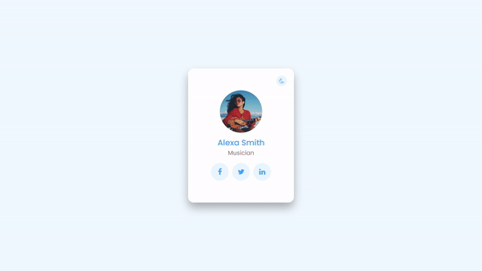

## English
# User Card with Light & Dark Mode Toggle 🔆🌙

## Overview 📄

This project is a user card component with a light and dark mode toggle feature. It's a simple demonstration of using HTML, CSS, and JavaScript to create an interactive user interface.

## Technologies Used 💻

- HTML
- CSS
- JavaScript

## Features ✨

- User card display with name and role.
- Light and dark mode toggle.
- Social media links.

## Live Demo 🌐

You can try the live demo [here](https://evelinalvarado.github.io/dark-and-light-mode-toggle-user-card/).

## Result 🎥

## Credits 🙌

- Tutorial by [Online Tutorials](https://youtu.be/JhVMAzrvdos?list=PLpcT_04umvQL_ZBE5VwDpVc22TJxXgB6d)
- Image source: [Unsplash](https://unsplash.com)

## Español
# Tarjeta de Usuario con Alternancia de Modo Claro y Oscuro 🔆🌙

## Resumen 📄

Este proyecto es un componente de tarjeta de usuario con una función de alternancia de modo claro y oscuro. Es una sencilla demostración de cómo utilizar HTML, CSS y JavaScript para crear una interfaz de usuario interactiva.

## Tecnologías Utilizadas 💻

- HTML
- CSS
- JavaScript

## Funcionalidades ✨

- Visualización de tarjeta de usuario con nombre y rol.
- Alternancia de modos claro y oscuro.
- Enlaces a redes sociales.

## Demo en Vivo 🌐

Puedes probar la demo en vivo [aquí](https://evelinalvarado.github.io/dark-and-light-mode-toggle-user-card/).

## Resultado 🎥

## Créditos 🙌

- Tutorial de [Online Tutorials](https://youtu.be/JhVMAzrvdos?list=PLpcT_04umvQL_ZBE5VwDpVc22TJxXgB6d)
- Fuente de la imagen: [Unsplash](https://unsplash.com)

